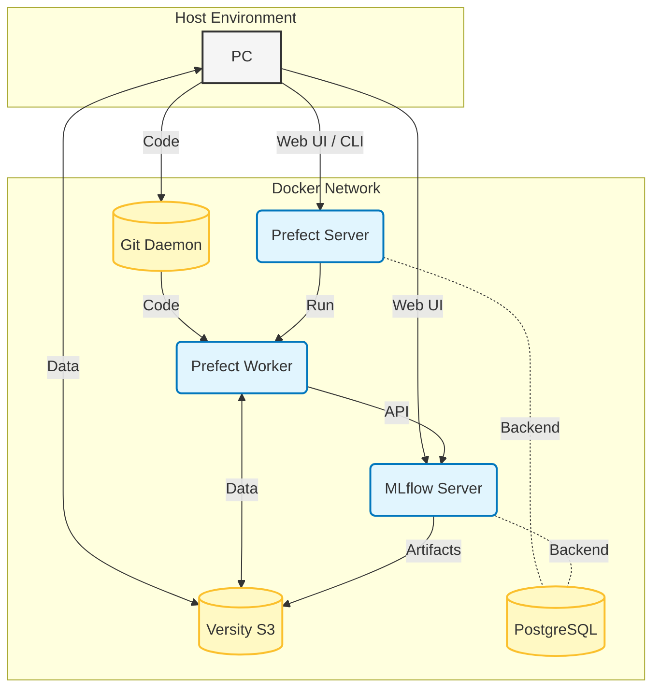

<!-- vim:set tw=72 nowrap spell: -->

# acap-datasci-env

"As-Cloud-As-Possible" Data Science Environment

## Overview

This repository provides a local Docker Compose environment that
simulates a cloud-native data science stack. It allows you to:

- **Store data**: Object storage via [versitygw] (S3 gateway).
- **Orchestrate**: Run data pipelines using [Prefect].
- **Track**: Log machine learning experiments and models with [MLflow].
- **Develop**: Interactively experiment in [Marimo] notebooks.

## Architecture



(Note: Marimo is omitted from this view as it is loosely coupled
with the core pipeline components.)

## Getting Started

### Prerequisites

In addition to Docker, having the following tools installed on your
host machine is recommended for interaction with the services:

- [uv]: For local Python package and environment management.
- [mc]: S3 client for managing object storage buckets.

### Setup Instructions

#### 1. Start the Services

Launch the environment using Docker Compose:

```console
$ docker compose -f docker-compose/docker-compose.yaml up -d
```

Once the containers are running, proceed with the configuration steps
below.

#### 2. Versity Gateway Configuration

To access S3 (Versity Gateway) from your host machine, export the
following environment variables:

```bash
export AWS_ACCESS_KEY_ID=versitygw
export AWS_SECRET_ACCESS_KEY=versitygw
export AWS_REGION=us-east-1
export AWS_ENDPOINT_URL=http://localhost:7070
```

Next, create the necessary buckets using the [mc] client.

- `mlflow`: Used by MLflow to store artifacts.
- `data`: Put any data to share with Prefect workflows.

```console
$ mc alias set local http://localhost:7070 versitygw versitygw

$ mc mb local/{mlflow,data}
```

#### 3. Prefect Configuration

To interact with the Prefect Server from your host, set the API URL:

```bash
export PREFECT_API_URL=http://localhost:4200/api
```

Additionally, the Prefect Worker is configured to use a work pool
named `sandbox`. Set this as your default to simplify deployment:

```bash
export PREFECT_DEFAULT_WORK_POOL_NAME=sandbox
```

#### 4. Internal Git Setup

This environment uses an internal Git daemon. The Prefect Worker
retrieves workflow code from this repository.

Initialize the repository inside the container and push your local code:

```console
$ docker compose -f docker-compose/docker-compose.yaml exec git \
    git init --bare /var/www/git/repo.git

$ git remote add local git://localhost:9010/repo
$ git push local main
```

### Run the Example Experiment

#### 1. Prepare the Data

Generate [the Iris dataset] CSV and upload it to S3:

```console
$ uv run python scripts/prepare_iris_csv.py

$ mc cp ./data/iris.csv local/data/
```

#### 2. Deploy the Workflow

Register the `experiments/example.py` workflow to the Prefect server:

```console
$ prefect deploy
```

#### 3. Trigger the Deployment

Finally, run the deployed workflow:

```console
$ prefect deployment run example/experiment
```

#### 4. Monitor and Analyze

- **Track progress**: Check the run status at the Prefect Web UI:
  <http://localhost:4200/runs>.
- **View Results**: Once complete, examine the logged metrics and
  models at the MLflow Web UI: <http://localhost:5001>.

## Appendix

### Where is the notebook server?

<http://localhost:2718>

[marimo]: https://marimo.io/
[mc]: https://github.com/minio/mc
[mlflow]: https://mlflow.org/
[prefect]: https://www.prefect.io/
[the iris dataset]: https://scikit-learn.org/stable/modules/generated/sklearn.datasets.load_iris.html
[uv]: https://docs.astral.sh/uv/
[versitygw]: https://www.versity.com/products/versitygw/
